# The Early Birdie

This website is for a breakfast restaurant. It has a simple contrast with the black and white colors and nice, colorful pictures. The user can create an account where they can make and view their bookings for the restaurant. It is also possible to delete or edit their bookings. When the admin has confirmed their booking it is visible on their bookings too.

Live link: https://the-early-birdie.herokuapp.com/

(To open links in a new tab, hold 'Ctrl' (or '⌘' on Apple devices) as you click!)

# User Experience (UX)

## Visitor Goals

* Easily understandable, clear, and quick to use
* Be able to see the menu, opening times, and map/location.
* Be able to create, read, update, and delete bookings.
* See if their booking has been confirmed or not
* Have access to social media websites

## Owners Goals
* To promote the restaurant
* Increase bookings
* Encourage people to share their experience
* Be able to create, read, update, and delete bookings.
* Be able to confirm bookings.

## User Stories
- As a Site User I can choose from available times and dates for a booking so that is reserved for when I need it to be
- As a Site User I can request a booking so that my reservation is progressed
- As a Site User I can create, read, update and delete bookings so that I can manage my reservation
- As a Site Admin I can approve or disapprove bookings so that I can manage availability
- As a Site User I can receive confirmation about my booking so that I am assured it has been approved
- As a Site Admin I can view bookings so that I can read all the details

## Features

### Navbar:

The navigation has a bird logo and the name of the Restaurant, which is also a button that brings the User back to the main page. On the right-hand side, it has the navigation buttons for Home, Menu, Register, and Login. This changes if a User is authenticated. The My bookings and Logout appear instead of Register and Login.
On small screens, The User can toggle between showing and hiding the navigation menu links when the user clicks on the hamburger menu/bar icon.
Included on all the pages.

### Footer:

Simple, responsive social media logos from [Font Awesome](https://fontawesome.com/). Opens on a new tab.
Included on all the pages.

### Index page:

The main page includes a nice big picture positioned to the right and the welcome message on the left overlapping and transparent. It has a button sending the user to the login page/booking form(if authenticated). On the bottom, a map is included pointing to the location where it can be found (It is just pointing to central London at the moment).

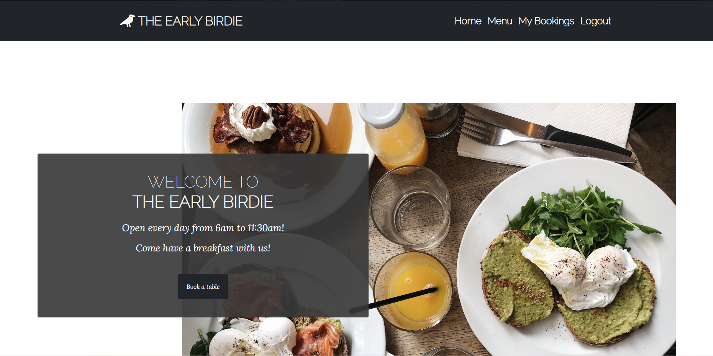

### Menu:

The menu is quite simple. It is a list of items with the prices on the right. It has a double border.

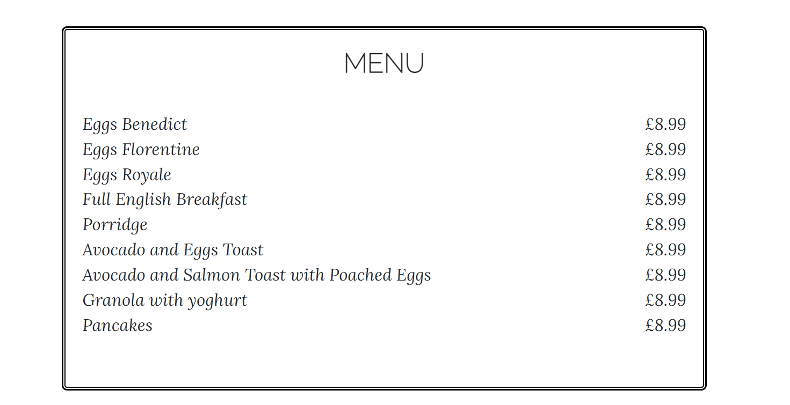

### Login, Register, Logout:

The authentication pages have the same CSS and layout. All three have nice colorful pictures, and forms styled with [crispy forms](https://django-crispy-forms.readthedocs.io/en/latest/) and [box shadow](https://getcssscan.com/css-box-shadow-examples).
Messages appear if registered, logged in or out, made, delete, or edit a booking with a possibility to close it or disappear automatically.

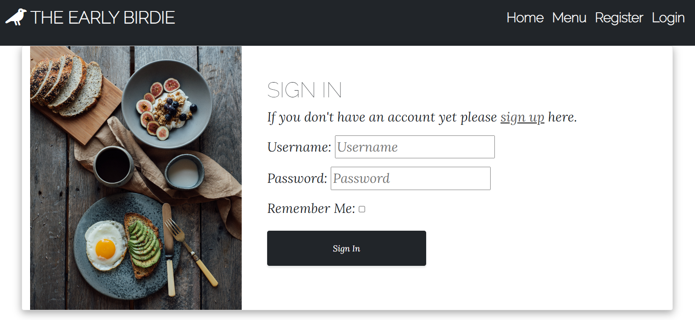
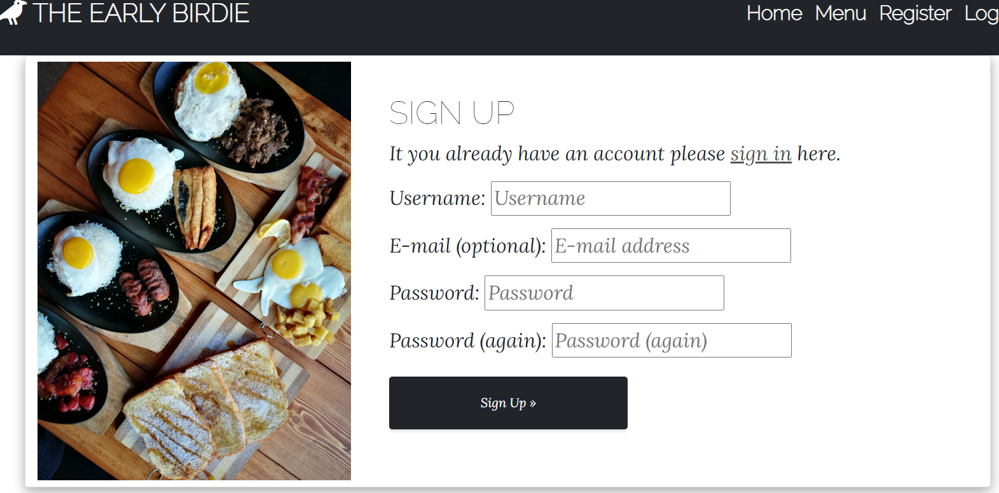
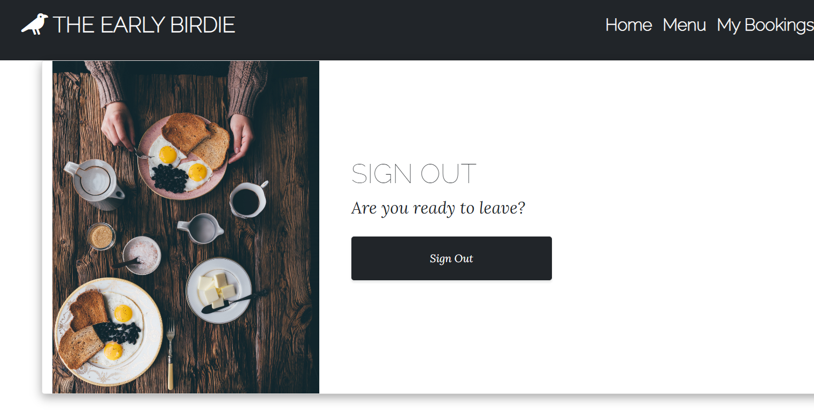

### My Bookings:

The My bookings page is a list of bookings, that have been made by the User. It includes name, date, time, party size, and if the booking is confirmed or not by the Admin. The rows are clickable, they open up a new row which includes the date when the booking was made, the account name, and the extra info. It also reveals the edit and delete buttons.
On the bottom of the list is a Book a table button that takes the user to the Add a New Booking page.

When the Admin looks at this page they see the bookings made by all the Users. The layout is the same. The Edit and Delete and Book A Table options are also present. The confirmed logo is a button here, that toggles to confirm or to remove the confirmation.

#### Edit Booking, Add a New Booking

These are sisters. They look the same apart from the button and the Edit Booking has a prefilled form with the current booking information.
Forms styled with [crispy forms](https://django-crispy-forms.readthedocs.io/en/latest/) and [box shadow](https://getcssscan.com/css-box-shadow-examples).
The forms include: Booked date (mandatory), Booked time (mandatory, the input must be between 6am to 11am), Name (mandatory), Party size (mandatory, has a minimum of 1 and a maximum of 10), Extra info (For food allergies, dietary requirements, special occasions or requirements)

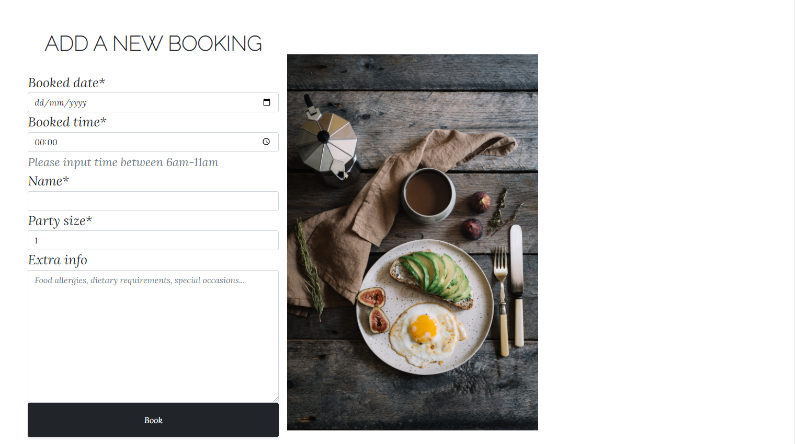

#### Delete Booking

Same to the previous two in style and picture. It has only two buttons to confirm booking deletion or to go back to the My bookings page.

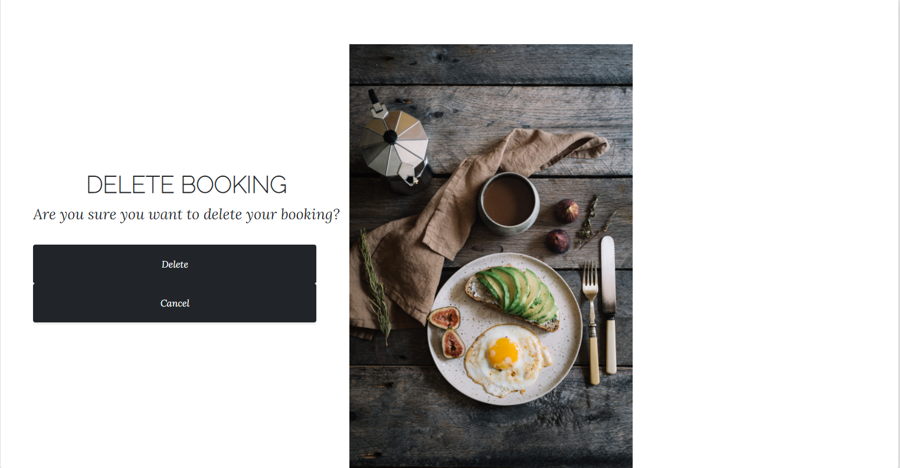

### Design / Colour Scheme

The design of this website has a simple color scheme. Mostly black and white or gray that contrasts each other and makes the colorful pictures pop. 
It has different pictures of delicious breakfast dishes on many pages. 

The landing page has a nice eye-catching picture with a welcome message. Next to the navigation bar, there is the logo of a bird fitting the name of the restaurant.
The main page also has a full-width map, just above the social media links.

The menu is nice and simple just with a little boarding.

The My Bookings page is just a list of bookings, with a green confirmation logo. It has an empty circle when it is not confirmed and a full green tick when it is confirmed. The list rows are clickable, and they expand for one more line with extra information and also the edit and delete buttons.

The account pages all have a similar design with different pictures, and so does the Add A New Booking form. The forms use crispy forms.

#### Typography

[Google Fonts](https://fonts.google.com/): Raleway and Lora with a fallback of sans-serif
 
#### Imagery

The icons I used are from [Font Awesome](https://fontawesome.com/).
Pictures are from [Pexels](https://www.pexels.com/sv-se/).

## Technologies
 ### Languages
   - CSS3
   - HTML5
   - JavaScript
   - Django 3.8

  ### Libraries, Websites & Programs Used
  * [Font Awesome](https://fontawesome.com/)
  * [Google Fonts](https://fonts.google.com/)
  * [Gitpod](https://gitpod.io/projects)
  * Paint
  * [Jsfiddle](https://jsfiddle.net/)
  * [CSS Scan](https://getcssscan.com/css-box-shadow-examples)
  * [cloudinary](https://cloudinary.com/)
  * [heroku](https://dashboard.heroku.com/apps)
  * [psycopg2](https://pypi.org/project/psycopg2/)
  * [Bootstrap5](https://bootstrap-vue.org/docs)
  * [Crispy forms](https://django-crispy-forms.readthedocs.io/en/latest/)
  * [AllAuth](https://django-allauth.readthedocs.io/en/latest/installation.html)

## Testing

I have only done manual testing with Django.

### Forms tests:
  - All mandatory fields are validated and indicated with an asterisk (*) symbol 
  - Validation error messages appear correctly in the right place
  - Dates are in the correct format
  - Helper text is visible and understandable
  - Dropdown select has a min and max value
  - Non-mandatory field has a placeholder with a clear explanation
  - The delete functionality asks for confirmation
  - Field labels are correct
  - Checked the functionality of buttons available on all pages.
  - Checked the text on all pages for spelling and grammatical errors
  - The user is not able to submit a page twice by pressing the submit button quickly.
  - Success and info messages appear correctly with the right color.
  - Validated all web pages (validate HTML and CSS for syntax errors)

### Database tests:
  - Checked if the correct data is getting saved in the database upon a successful page submit
  - Checked for data integrity. Data is stored in tables.
  - Table columns have description information available

### Performance
  - Loading time is acceptable
  

I have tested the website on multiple devices (phone, laptop, and desktop).

### Validator testing

CSS: No errors were found when passing through the [Jigsaw](https://jigsaw.w3.org/css-validator/validator?uri=https%3A%2F%2Fthe-early-birdie.herokuapp.com%2F&profile=css3svg&usermedium=all&warning=1&vextwarning=&lang=sv) validator

[Css-test](static/images/css-validator.png)

HTML: No errors were returned when passing through the official [W3C](https://validator.w3.org/nu/) validator:

- [Index](https://validator.w3.org/nu/?doc=https%3A%2F%2Fthe-early-birdie.herokuapp.com%2F)
- [Menu](https://validator.w3.org/nu/?doc=https%3A%2F%2Fthe-early-birdie.herokuapp.com%2Fmenu%2F)
- [Bookings](https://validator.w3.org/nu/?doc=https%3A%2F%2Fthe-early-birdie.herokuapp.com%2Fbookings%2F) - on Admin page
- [Add Booking](https://validator.w3.org/nu/?doc=https%3A%2F%2Fthe-early-birdie.herokuapp.com%2Fadd_new_booking%2F)
- [Signup](https://validator.w3.org/nu/?doc=https%3A%2F%2Fthe-early-birdie.herokuapp.com%2Faccounts%2Fsignup%2F)
- [Login](https://validator.w3.org/nu/?doc=https%3A%2F%2Fthe-early-birdie.herokuapp.com%2Faccounts%2Flogin%2F)
- [Logout](https://validator.w3.org/nu/?doc=https%3A%2F%2Fthe-early-birdie.herokuapp.com%2Faccounts%2Flogout%2F)

### JSHint

JavaScript has been tested with [JSHint](https://jshint.com/). No error was found.

[JSHint](static/images/jshint.png)

### Wave Tests
The [Wave](https://wave.webaim.org/) test reports an error of an empty link on small screens, which is the hamburger menu/bar icon.

- [Index](https://wave.webaim.org/report#/https://the-early-birdie.herokuapp.com/)
- [Menu](https://wave.webaim.org/report#/https://the-early-birdie.herokuapp.com/menu/)
- [Bookings](https://wave.webaim.org/report#/https://the-early-birdie.herokuapp.com/bookings/)
- [Signup](https://wave.webaim.org/report#/https://the-early-birdie.herokuapp.com/accounts/signup/)
- [Login](https://wave.webaim.org/report#/https://the-early-birdie.herokuapp.com/accounts/login/)

### PEP8 Tests

- views.py (Has 2x too long line)
- urls.py (Has 2x too long line)
- models.py (Has 1x too long line)
- forms.py (Has 1x too long line)
- admin.py (Has 1x too long line)

### Lighthouse Test

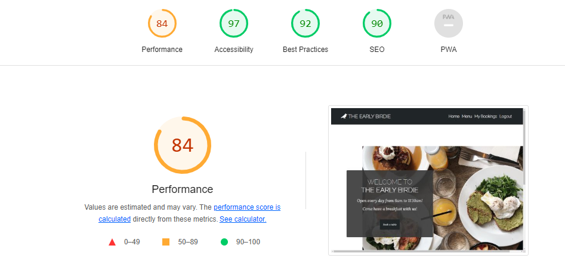

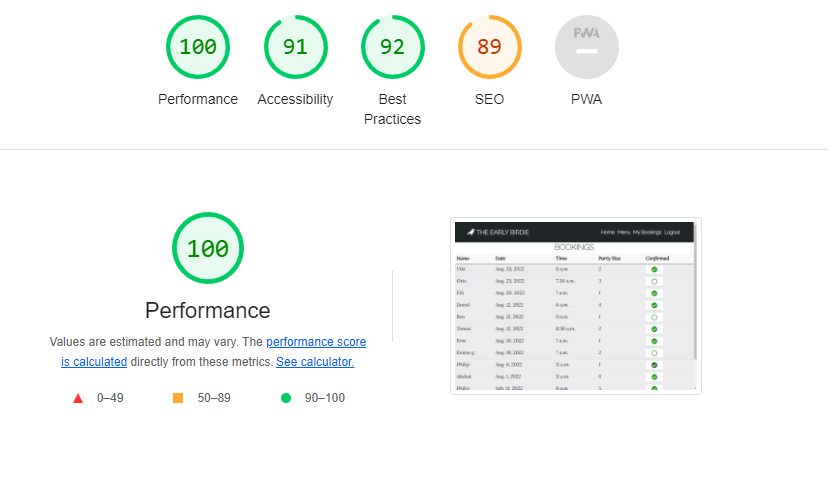

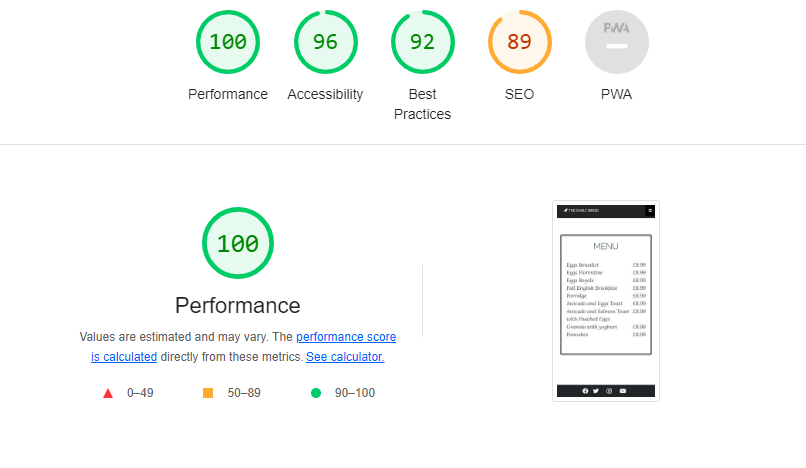

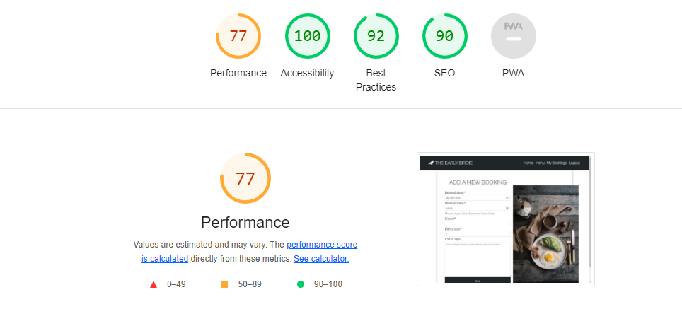

### Bugs

* Confirmation message doesn't send to User. - This bug hasn't been fixed due to lack of time.
* On the My Bookings lists needs to be clicked twice for the first time on the list items to toggle the open the second line. - This hasn't been fixed due to lack of time.
* If the admin edits a User's booking the account name changes so it can't be seen anymore by the User - This hasn't been fixed due to lack of time.
* On Add a new booking page it is possible to book passed dates - This hasn't been fixed due to lack of time.

* On the Add a new booking page, it was possible to all-day times. - This has been fixed with a help-text and min and max value for the booking times.
* On the Edit booking page, the date was not returned when trying to edit a booking. - This has been fixed by changing the date format.
* When a booking was made and the page got refreshed the booking went through again creating double bookings. - This has been fixed by redirecting to the My bookings page right after sending the booking.

## Deployment
This project was deployed using Code Institute's mock terminal for Heroku.

 - Steps for deployment:
   - Login on the Heroku website
   - Click on New, then Create a new app
   - In the Settings, set the Config Vars.
   - In the Deploy tab connect your Github
   - Scroll to Manual deploy and click on Deploy Branch

 ### Forking
 * If you wish to fork the repository:
    - GitHub Search my username and repository
    - Select the repository
    - Click the fork icon in the top right
    - This creates a fork within your GitHub repositories
    - Edit the files as necessary to your remote repository

## Credits
- I Think Therefore I Blog and Hello Django project
- [Font Awesome](https://fontawesome.com/)
- [W3School](https://www.w3schools.com/css/default.asp)
    - https://www.w3schools.com/howto/tryit.asp?filename=tryhow_js_mobile_navbar
- [Stack Owerflow](https://stackoverflow.com/)
    - https://stackoverflow.com/questions/60603692/generate-unique-id-in-each-loop-of-for-loop-django-template
    - https://stackoverflow.com/questions/6301741/django-integerfield-with-choice-options-how-to-create-0-10-integer-options
    - https://stackoverflow.com/questions/49141414/editing-a-slug-post-in-django
    - https://stackoverflow.com/questions/42089277/how-to-modify-a-boolean-field-model-in-django
- https://www.youtube.com/watch?v=Ll59LAOHdXc&list=PLInvlTu9nmo8ttdXgiD4S7sHiHL2iRVY5&index=19
- [Pexels](https://www.pexels.com/sv-se/)
- [CSS Scan](https://getcssscan.com/css-box-shadow-examples)
- https://www.geeksforgeeks.org/how-to-make-html-table-expand-on-click-using-javascript/?fbclid=IwAR1hVkf9KzZjewn6agXULtWcXnuknO4pAtlW11MqNG2FVz4O6JVx_SdzHvA
- https://www.fullstackpython.com/django-shortcuts-render-examples.html
- https://learndjango.com/tutorials/django-slug-tutorial
- https://thetldr.tech/how-to-fix-any-django-migration-issue-in-local/
- https://realpython.com/django-social-forms-4/
- https://mdbootstrap.com/docs/standard/extended/login/
- https://www.softwaretestinghelp.com/sample-test-cases-testing-web-desktop-applications/
- Thank you for my mentor in reviewing and helping with the code.